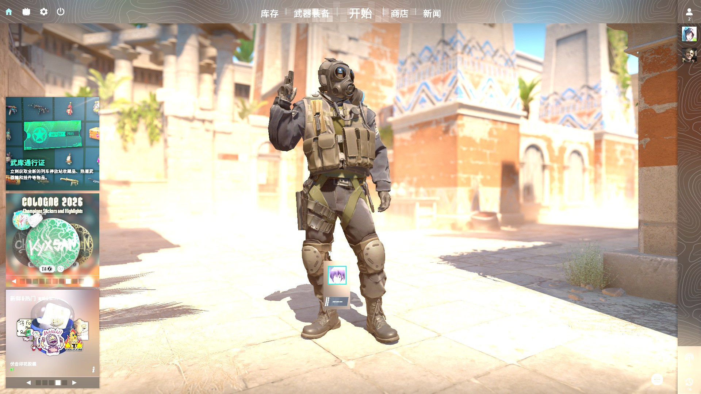
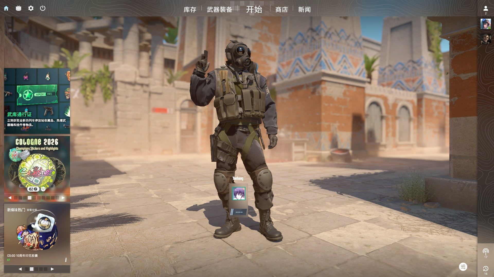

<h1 align="center">ShareX HDR</h1>
<h3 align="center">Fix washed-out HDR screenshots on Windows — ShareX with true HDR-aware screen capture</h3>
 

  
  
  
  

 

**ShareX HDR** is a fork of [ShareX](https://github.com/ShareX/ShareX) that fixes the long-standing problem of **washed-out, overbright, gray-looking screenshots when Windows HDR is enabled**. If your screenshots of HDR games (CS2, Cyberpunk 2077, Elden Ring…) or an HDR desktop look faded, blown out, or desaturated with regular ShareX, Snipping Tool, or Print Screen — this build captures them correctly.

## Before / After

CS2 with Windows HDR enabled, captured with the same hotkey:

| Stock capture (washed out) | ShareX HDR (tone mapped) |
| --- | --- |
|  |  |

## Download

Grab the latest installer or portable build from the **[Releases page](https://github.com/shuakami/ShareX-HDR/releases/latest)**:

| File | Description |
| --- | --- |
| `ShareX-*-setup-x64.exe` | Installer (Windows x64) |
| `ShareX-*-portable-x64.zip` | Portable, no install (Windows x64) |
| `ShareX-*-setup-arm64.exe` / `-portable-arm64.zip` | Windows on ARM |

HDR color correction is **enabled by default** — just install and take screenshots as usual (Print Screen, region capture, window capture, auto capture all benefit).

## Why are my HDR screenshots washed out?

When Windows HDR (advanced color) is on, the desktop is composed in **FP16 linear scRGB**, where brightness can go far beyond SDR white. Legacy capture paths (GDI `BitBlt`, used by classic ShareX and most screenshot tools) read an 8-bit clipped rendition of that framebuffer, so highlights blow out and everything looks gray and faded.

**ShareX HDR** replaces that path with a modern GPU capture + proper tone mapping pipeline:

* **FP16 capture, no GDI** — the desktop is captured via **DXGI Desktop Duplication** in `R16G16B16A16_FLOAT`, preserving the full HDR signal end to end.
* **Reference-grade tone mapping** — HDR frames are mapped to SDR with a **BT.2390 EETF** roll-off evaluated in the **PQ (ST.2084)** domain, anchored to each monitor's actual **SDR reference white level** from Windows — so UI and text keep 1:1 brightness while highlights are compressed smoothly instead of clipping.
* **Hue-preserving gamut mapping** — luminance-domain mapping with soft desaturation of out-of-gamut colors avoids the hue shifts of per-channel clipping.
* **No banding** — ordered dithering is applied before 8-bit quantization, keeping skies and gradients smooth.
* **Adaptive highlight compression** — per-frame peak content luminance is estimated (PQ-domain histogram, 99.99th percentile), so the tone curve only compresses as much as the frame needs.
* **Fast** — duplication sessions are cached per monitor and tone mapping is fully parallelized, so repeated captures (auto capture, region capture) only pay a GPU copy + tone map. Mixed HDR + SDR multi-monitor setups are handled per output, and it automatically falls back to classic GDI capture on unsupported systems.
* **Better JPEG quality** — JPEG is encoded through **WIC** instead of legacy GDI+, giving visibly cleaner text edges and faster encoding at the same quality setting.

Everything else — uploads, annotations, workflows, hotkeys — is 100% standard ShareX.

## Keywords

HDR screenshot washed out fix · Windows 11 HDR screenshot too bright · ShareX HDR support · CS2 HDR screenshot gray · screenshot HDR tone mapping · DXGI Desktop Duplication FP16 · scRGB to sRGB · BT.2390 · SDR white level · HDR screen capture tool for Windows

## Usage notes

* Requires Windows 10/11 with a DirectX 11 capable GPU. On non-HDR displays behavior is identical to stock ShareX.
* Toggle: the capture task setting `UseHDRColorCorrection` (on by default).
* Something look off? Check the ShareX debug log (`Debug → Log`) for `Desktop duplication session created … HDR=True` lines and [open an issue](https://github.com/shuakami/ShareX-HDR/issues).

## Links (upstream ShareX)

* Official website: https://getsharex.com
* Upstream GitHub: https://github.com/ShareX/ShareX
* Image effects: https://getsharex.com/image-effects
* Actions: https://getsharex.com/actions
* Keybinds: https://getsharex.com/docs/keybinds
* Scrolling screenshot: https://getsharex.com/docs/scrolling-screenshot
* Command line arguments: https://getsharex.com/docs/command-line-arguments
* OCR: https://getsharex.com/docs/ocr
* Custom uploader: https://getsharex.com/docs/custom-uploader

## License

[GPL v3](./LICENSE.txt) — same as upstream ShareX. All credit for the base application goes to the [ShareX Team](https://github.com/ShareX/ShareX).
